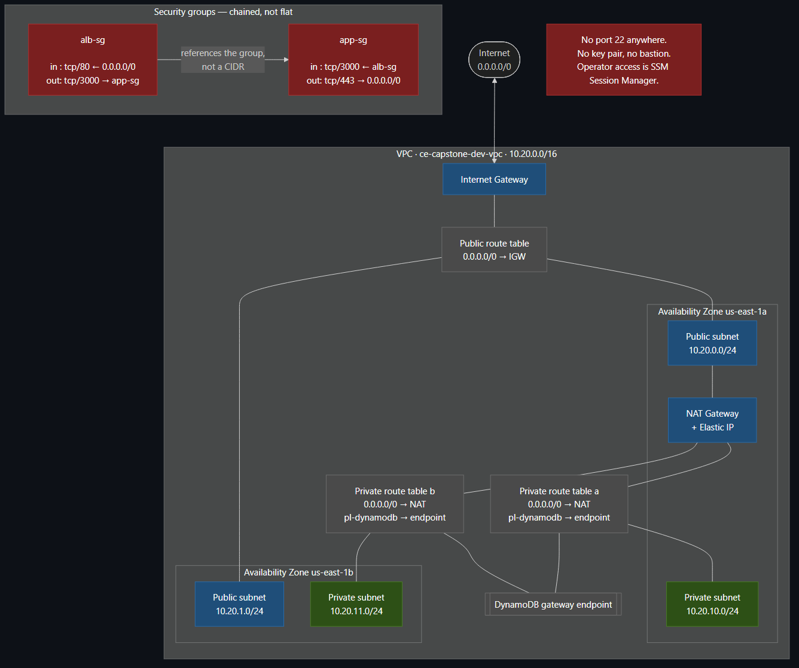
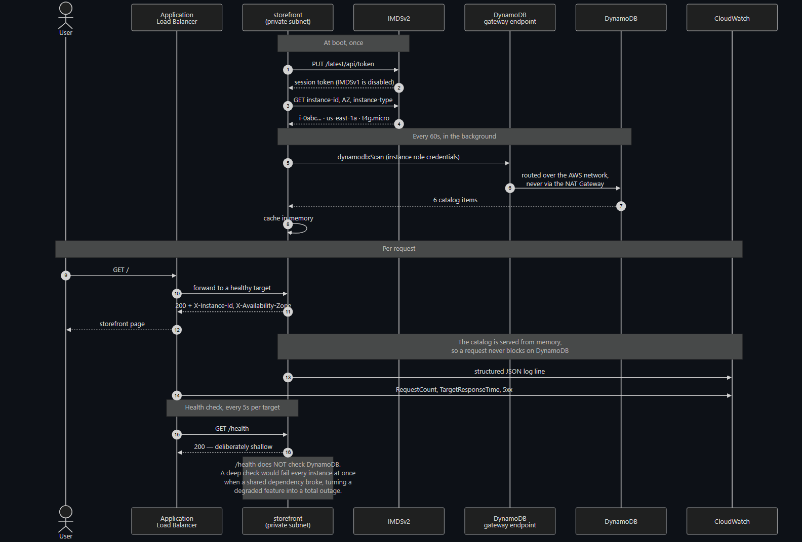
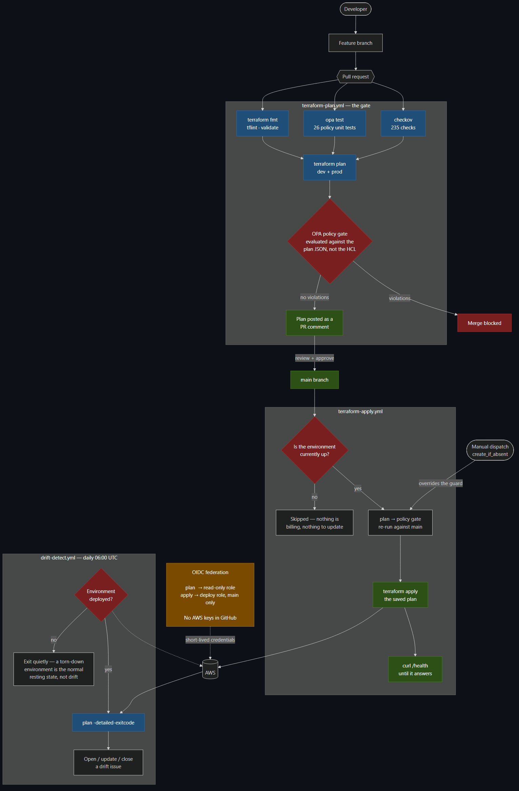

# Architecture

How the platform is put together, and why each piece is the shape it is.

The design is driven by one constraint stated up front, because it explains
choices that would otherwise look like mistakes: **this environment is destroyed
between working sessions.** A NAT Gateway bills whether or not anyone uses it,
so an environment that runs continuously costs roughly USD 71/month against
about USD 13 for one that exists only while being worked on.

---

## Overview


Three tiers, network-isolated, spanning two availability zones:

| Tier | Lives in | Contains |
|---|---|---|
| Edge | Public subnets | Application Load Balancer, NAT Gateway |
| Application | Private subnets | Auto Scaling group of 3–6 instances |
| Data | No subnet at all | DynamoDB, reached via a VPC gateway endpoint |

The data tier is worth a second look. DynamoDB is a regional service rather
than something placed in a subnet, and the gateway endpoint means catalog
traffic is routed over the AWS network without traversing the NAT Gateway or
touching the internet. The tier boundary is enforced by IAM rather than by
network placement — the instance role grants five read-only actions on exactly
one table ARN.

---

## Network



A `10.20.0.0/16` VPC across `us-east-1a` and `us-east-1b`. Subnet CIDRs are
derived with `cidrsubnet()` rather than listed by hand, so the module produces a
correct layout for any VPC size or AZ count:

| Subnet | AZ a | AZ b | Routes to |
|---|---|---|---|
| Public | 10.20.0.0/24 | 10.20.1.0/24 | Internet Gateway |
| Private | 10.20.10.0/24 | 10.20.11.0/24 | NAT Gateway, and the DynamoDB endpoint |

Public and private ranges are separated by ten in the third octet purely so the
two tiers are visually distinguishable in the console at a glance.

### One NAT Gateway, on purpose

Dev shares a single NAT Gateway across both private subnets. Prod uses one per
zone. This is the most consequential trade in the project and has its own
record: [ADR 0002](docs/decisions/0002-single-nat-gateway.md).

The short version: a second gateway is USD 33/month, nearly half the dev bill.
The failure it protects against is losing the AZ that hosts the shared gateway,
which would cost the surviving zone its *outbound* connectivity — package
installs on newly launched instances, and CloudWatch telemetry. It would not
stop the platform serving requests, because inbound traffic arrives through a
genuinely multi-AZ load balancer and the catalog is read over a gateway endpoint
that does not involve the NAT at all. Degraded operations, not an outage.

The module keeps a separate private route table per AZ even when they all point
at one gateway, so switching postures is a single boolean rather than a
restructuring.

### Security groups are chained, not flat

```
internet → alb-sg  in:  tcp/80   from 0.0.0.0/0
                   out: tcp/3000 to   app-sg      ← not "all traffic"

           app-sg  in:  tcp/3000 from alb-sg      ← a group, not a CIDR
                   out: tcp/443  to   0.0.0.0/0
```

Two details do the real work.

The application rule references the load balancer's *security group*, not a
CIDR range. It stays correct however the ALB nodes are re-addressed, and it
cannot be satisfied by anything else that happens to share an IP range.

The load balancer's egress is restricted to the application tier rather than
left open. A compromised load balancer cannot be used to reach anything else in
the VPC.

There is no port 22 rule anywhere, and no key pair exists. Operator access is
SSM Session Manager over the instance role, which needs no inbound port and is
audited in CloudTrail.

---

## Application tier

An Auto Scaling group of `t4g.micro` instances — Graviton, roughly 20% cheaper
than the equivalent x86 `t3` — spread across both private subnets with
`balanced-best-effort` distribution, so losing a zone loses a predictable
fraction of the fleet.

| | dev | prod |
|---|---|---|
| Instance type | t4g.micro | t4g.small |
| Min / desired / max | 3 / 3 / 6 | 3 / 3 / 12 |
| Scaling setpoint | 50% CPU | 40% CPU |
| Health check | ELB | ELB |

Scaling is **target tracking** rather than step scaling. The intent — hold
average CPU near the setpoint — is stated once, and AWS manages the alarms and
cooldowns that implement it. Step scaling would encode the same intent across
four alarm definitions that then have to be kept consistent with each other.

Health checks are `ELB`, not `EC2`. EC2 health only notices an instance the
hypervisor considers stopped; ELB health also catches the far more common case
where the instance is running fine and the application is wedged.

### Deployment is an instance replacement

The application is embedded in the launch template's user-data as a
gzip+base64 blob ([ADR 0004](docs/decisions/0004-application-in-user-data.md)).
Editing `app/src/server.js` produces a new launch template version, which the
Auto Scaling group rolls out as an instance refresh holding 66% of capacity
healthy throughout.

The consequence that matters: the application and the infrastructure running it
are versioned in the same commit. There is no way for them to be at different
versions, because there is only one version. A rollback is `git revert`.

The cost is a hard 16 KB user-data limit. The application is ~16 KB of source,
compressing to ~7.5 KB encoded — comfortable, but not unlimited. This decision
does not survive the application growing dependencies, and the ADR says so.

---

## Data tier

A DynamoDB table in on-demand billing mode, seeded with six catalog rows managed
as code so a freshly created environment demos immediately with no manual step.

DynamoDB rather than RDS ([ADR 0003](docs/decisions/0003-dynamodb-over-rds.md))
comes down to the ephemeral constraint again: on-demand billing costs nothing
while nothing is being served, whereas a `db.t4g.micro` would bill ~USD 12/month
regardless — and would keep billing after a teardown unless it were destroyed
too, which then means restoring data on every bring-up.

What is given up is real: no joins, no cross-entity transactions, no ad-hoc
queries. The application currently `Scan`s the table, which is the wrong access
pattern at any real scale and is marked as such in the code. At six rows it is
honest; at six thousand it would need a partition key and a `Query`.

### Recovery

Two layers, covering different failures:

- **Point-in-time recovery** — continuous, 35-day window, ~5 minute RPO.
  Covers a bad write or an accidental delete.
- **AWS Backup** — daily scheduled snapshots into a separate vault, 7-day
  retention in dev and 35 in prod. Covers what PITR cannot: deletion of the
  table itself.

The backup selection targets an explicit table ARN rather than a tag, because
tag-based selection silently stops protecting a resource the moment someone
edits a tag.

---

## Request and data flow



The catalog is refreshed on a 60-second timer into memory, and requests are
served from that snapshot. A request never blocks on DynamoDB, so a data-tier
problem degrades to stale data rather than to failed requests.

### The health check is deliberately shallow

`/health` reports whether *this process* can serve traffic. It does not check
DynamoDB.

This is the single most important design decision in the observability setup,
and it is counter-intuitive. A "thorough" health check that verifies every
dependency fails on **every instance simultaneously** the moment a shared
dependency has a problem — which empties the target group, and converts a
degraded feature into a total outage. The blast radius of a deep health check is
the entire fleet.

Instead, catalog health is surfaced as a field in the `/health` payload
(`catalog.degraded`), rendered on the dashboard, and visible in the logs. The
storefront keeps serving its last known catalog.

---

## High availability

| Failure | What happens |
|---|---|
| One instance dies | ASG replaces it in ~99s. A ~10s window of 5xx for requests routed to it before health checks notice — [measured](docs/incident-reports/2026-08-31-failover-502-window.md) |
| One AZ fails | The ALB stops routing there; the surviving zone serves. If it was the NAT's zone, dev loses outbound connectivity but keeps serving |
| The application crashes | systemd restarts it within 5s; if it does not recover, ELB health checks pull it and the ASG replaces it |
| A bad deployment | Instance refresh with `auto_rollback` reverts to the previous launch template version |
| Region failure | Not survivable. Single-region by design; see below |

The honest limits are worth stating plainly. This is a single-region
architecture with an RTO measured in however long it takes to run
`scripts/up.sh` in another region, and an RPO for the catalog of about five
minutes via PITR. Multi-region was on the list of possible Excellence
requirements and was not chosen, because doing it properly means solving data
replication and DNS failover — and doing it improperly means a second idle
stack that doubles the bill while providing false confidence.

---

## Delivery pipeline



Four workflows, all authenticating through GitHub OIDC. There are no AWS access
keys in the repository's secrets.

**Pull request** runs `terraform fmt`, tflint, `validate` on every module
standalone, the 26 OPA policy unit tests, and checkov — then plans both
environments, gates each plan against the OPA policies, and posts the result as
a single PR comment that updates in place rather than accumulating.

The policy gate evaluates `terraform show -json`, not the HCL source. That
distinction matters: the plan has variables resolved, modules expanded and
provider `default_tags` merged in. A policy written against source can be
defeated by a variable; one written against the plan cannot.

**Merge to main** re-plans, re-gates (main may have moved since the PR was
planned), applies the saved plan rather than a fresh one, and then polls
`/health` until the storefront actually answers.

Two roles rather than one: the plan role is read-only and its trust policy
accepts pull-request tokens; the apply role can deploy and accepts only tokens
whose subject is `refs/heads/main`. A pull request, including one from a fork,
cannot mint a token that satisfies the apply role's trust policy.

---

## Environments

Both environments are the same modules with different variables, so the
production posture is readable as a diff of two `terraform.tfvars` files:

| | dev | prod | Why |
|---|---|---|---|
| NAT Gateways | 1 shared | 1 per AZ | Availability over cost |
| Instance type | t4g.micro | t4g.small | Headroom |
| Max size | 6 | 12 | Room to absorb a spike |
| Scaling setpoint | 50% | 40% | Scale before latency moves, not after |
| Deletion protection | off | **on** | Teardown must work in dev; must not in prod |
| Log retention | 7 days | 30 days | Investigation window vs ingestion cost |
| Detailed monitoring | off | on | 1-minute metrics are worth USD 2.10/instance in prod |
| Backup retention | 7 days | 35 days | Real recovery window |
| Latency budget | 1.0s | 0.5s | Tighter SLO |

**prod is maintained as code but is not kept running.** Leaving a second full
stack up would roughly triple the spend for a demonstration that runs on dev.
It is applied on demand to show the same codebase producing a production-grade
posture — and it is planned on every pull request, so it cannot silently rot.

---

## Technology choices, briefly

| Chosen | Over | Because |
|---|---|---|
| DynamoDB | RDS | No idle cost; free gateway endpoint; IAM-scoped access. [ADR 0003](docs/decisions/0003-dynamodb-over-rds.md) |
| EC2 + ASG | ECS/Fargate | Advanced requirements were met without replacing the whole compute module |
| user-data | ECR image | No artifact store in the boot path; app and infra in one commit. [ADR 0004](docs/decisions/0004-application-in-user-data.md) |
| Node, no dependencies | Node + npm | Nothing to download at boot means nothing to fail at boot |
| AWS CLI for DynamoDB | AWS SDK | Preinstalled on AL2023; no `npm install` step; picks up the instance role automatically |
| S3 native locking | DynamoDB lock table | Terraform ≥1.10 feature — one less resource to create, pay for, and forget to destroy |
| Target tracking | Step scaling | States the intent once instead of encoding it in four alarms |
| OPA/Rego | Sentinel | Open source, runs locally and in CI identically, testable with `opa test` |

---

## Known limitations

Stated here rather than discovered by a reviewer.

- **No HTTPS.** Needs a domain and an ACM certificate. This is the largest
  single gap and the source of five scanner findings.
- **Single region.** No cross-region DR.
- **`Scan` on the catalog.** Correct at six rows, wrong at scale.
- **A ~10s error window on ungraceful instance failure.** Measured, reduced,
  and irreducible without a retrying layer above the load balancer.
- **No WAF.** ~USD 5/month plus per-request charges against a read-only
  storefront.
- **No ALB access logs.** Would need a second bucket; request telemetry is
  already covered by ALB metrics, application logs and VPC flow logs.
