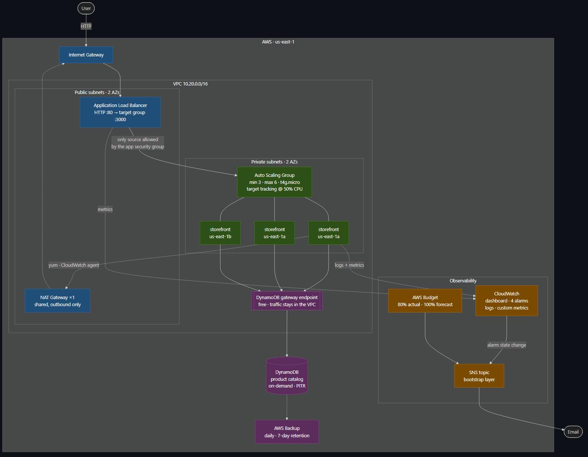

<!-- _class: lead -->

# ce-capstone

## A production-ready cloud platform that deletes itself

<br>

**Dennis Beitel**
Ironhack Cloud Engineering Bootcamp · Week 9

<br>

<span class="muted">github.com/Draian123/CapstoneProject</span>

---

## The problem I actually had

I wanted a production-grade AWS platform for my portfolio.

I did not want to pay **USD 71/month** for it to sit idle overnight.

<br>

### So the constraint became the design brief

> Build something that is genuinely production-shaped — multi-AZ, load
> balanced, monitored, secured — **and that can be destroyed and rebuilt in six
> minutes.**

<br>

That one constraint drove more decisions than anything else, and it is the
thread through everything that follows.

---

## What it is

```
Internet → ALB          (public subnets, 2 AZs)
             → ASG      3 × t4g.micro (private subnets, 2 AZs)
                 → DynamoDB catalog (VPC gateway endpoint)
```

<br>

| | |
|---|---|
| **77 resources** | in the dev environment |
| **4 modules** | networking · data · compute · monitoring |
| **~6 minutes** | from nothing to serving traffic |
| **~USD 0.096/hour** | while it exists |

<br>

The application is deliberately trivial. The infrastructure is the project.

---

## Architecture



---

## Three tiers, isolated by different mechanisms

| Tier | Where | Isolated by |
|---|---|---|
| Edge | Public subnets | Security group: only 80 from the internet |
| Application | Private subnets | **No route from the internet at all** |
| Data | Not in a subnet | **IAM** — 5 read-only actions, 1 table ARN |

<br>

### Two details that matter

Security groups **reference each other**, not CIDR ranges. The app accepts
traffic from the ALB's *security group* — correct however the ALB is
re-addressed.

The ALB's **egress** is restricted to the app tier. A compromised load balancer
cannot reach anything else in the VPC.

---

## Live demo

<br>

### 1 · The storefront
Reload — the instance and AZ change. That is the load balancer working.

### 2 · The catalog
`/api/products` — read from DynamoDB over a VPC gateway endpoint.

### 3 · The dashboard
Request rate, latency percentiles, target health, live error logs.

### 4 · Kill an instance
`scripts/demo-failover.sh` — watch it heal, and count what it costs.

### 5 · The pipeline
A policy violation blocking a merge.

---

## Technical deep dive

# I claimed zero downtime.

# Then I measured it.

---

## The claim was half right

`scripts/demo-failover.sh` terminates an instance and probes `/health` once per
second throughout.

The Auto Scaling group replaced it exactly as designed.

**Six requests returned 502 anyway.**

<br>

### Why

A load balancer cannot route away from a dead target until its health checks
notice. Until then, it keeps sending traffic there.

```
error window = health check interval × unhealthy_threshold
             = 15s × 3
             = up to 45 seconds
```

---

## Three measurements, not two

| Health check | Window | Failed requests | Recovery |
|---|---|---|---|
| 15s × 3 | 45s | 6 | 171s |
| 10s × 2 | 20s | **5** | 195s |
| **5s × 2** | **10s** | **2** | **99s** |

<br>

The **middle row** is the one I kept.

Halving the theoretical window removed exactly **one** request — which is what
proved the window was an upper bound, not a prediction. That is why I pushed to
the floor the ALB allows instead of stopping at a number that looked reasonable.

<span class="muted">Recovery improved as a side effect: detection gates replacement.</span>

---

## Two is not zero, and cannot be

No amount of tuning eliminates the window. The load balancer has to *find out*.

<br>

### So the claim had to get more precise

| | |
|---|---|
| Zero-downtime **deployment** | ✅ Connection draining handles it |
| Zero-downtime **instance failure** | ❌ ~10 second window |

<br>

> The second version is less impressive. It is also the one that is true, and
> the one that survives being asked *"how do you know?"*

<span class="muted">Written up in docs/incident-reports/</span>

---

## Automation had to be told what "normal" is

Two guards exist because the default behaviour was wrong for an ephemeral
platform.

<br>

### Apply will not resurrect a torn-down environment

A merge to `main` updates a *running* environment. If it is down, the workflow
**skips with an explanation** — otherwise ordinary GitOps would silently start
the meter. Creating from nothing needs an explicit manual dispatch.

### Drift detection treats "empty" as normal

An environment with no resources is this platform's **resting state**, not a
finding. Without that check it would file a false issue every single morning.

---

## Policy as code

Six Rego policies gate every plan. **26 unit tests** check the policies
themselves.

<br>

Evaluated against `terraform show -json` — **not** the HCL.

The plan has variables resolved, modules expanded, `default_tags` merged. A
policy that reads source can be defeated by a variable. One that reads the plan
cannot.

<br>

### The one I did not expect to need

`availability.rego` fails the build if `min_size` < 3 or the group spans < 2 AZs.

The project's own HA requirement, enforced as a test rather than written in a
README where nothing checks it.

---

## Security posture

| | |
|---|---|
| AWS access keys | **None.** OIDC for CI, instance profile for EC2 |
| SSH | **None.** No key pair, no port 22, no bastion — SSM only |
| Public IPs on instances | **None.** Asserted by Terratest against AWS |
| IMDS | v2 required, hop limit 1 — closes the SSRF credential path |
| checkov | 235 passed · **0 failed** · 33 justified inline |

<br>

### The finding I deliberately did not fix

Enabling SNS encryption with the AWS-managed key would have **silently broken
alarm delivery** — CloudWatch cannot use that key. The scanner goes green while
the alerting path goes dark.

<span class="muted">A control that breaks what it protects is not a control.</span>

---

## Results — cost

| | Monthly |
|---|---|
| Built the obvious way, always on | **$127** |
| As designed, always on | **$71** |
| **As actually used** | **$13** |

<br>

<span class="big">90% reduction</span>

<br>

Biggest lever: **not running it when nobody is using it** (−82%).
Second: one shared NAT Gateway instead of two (−$33).

> The surprise: NAT + load balancer cost **$49**. The three instances doing the
> actual work cost **$18**. The plumbing is nearly 3× the workload.

---

## Results — verification

Nothing here is a claim about what the code should do. Each was run.

| | |
|---|---|
| OPA policy unit tests | 26 / 26 |
| Policy gate vs. real plan | 0 violations |
| checkov | 235 passed, 0 failed |
| tflint | clean, 7 directories |
| Application tests | 11 / 11 |
| Terratest | compiles on every PR, builds real infra on demand |
| Failover | measured 3× |

---

## What I would do differently

**Measure before documenting.** I wrote the resilience claim before testing it,
and had to correct it.

**Set up scanners on day one.** Retrofitting 33 justified suppressions was
tedious, and they would have influenced the design rather than been reconciled
with it.

**Things that monitor an environment must not share its lifecycle.** I put the
SNS topic in the environment. Every teardown produced a fresh unconfirmed
subscription — an alert channel that needs re-arming on every deploy is one that
gets ignored.

---

<!-- _class: lead -->

# Thank you

<br>

**github.com/Draian123/CapstoneProject**

<br>

<span class="muted">
README · ARCHITECTURE · SECURITY · RUNBOOK · COSTS · RETROSPECTIVE<br>
4 ADRs · 1 incident report · 4 diagrams
</span>

<br>
<br>

### Questions
